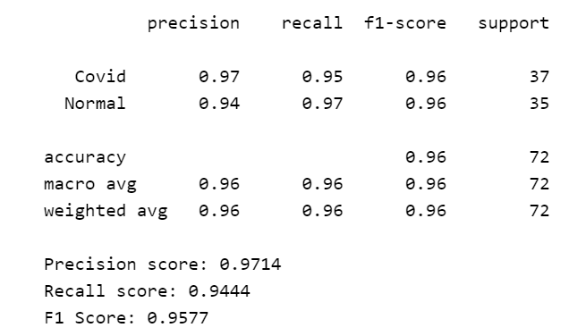

# Covid19 Xray Detection

## Introduction
Within the last decade, deep learning techniques have become much more readily available for the masses to use for research, enterprise and personal use. In particular, applications to the medical field are becoming much more widespread as this technology can greatly assist with radiology.

The unfortunate outbreak of Covid-19 has also let to a radical shift towards improving medical technologies and processes. The aim of this project, ableit educational, is to build a simple model which can differentiate between a healthy (normal) lung xray and an xray of a lung infected with Covid-19.

To re-iterate, this project is intended for educational purposes only, and not to be taken as a vetted model for Covid-19 assessments.

## Data Source
One of the main benefits of the open-source community is the ability to find readily available datasets for which to work with.

Two main datasets were used for this project:

- Covid-19 infected lung images were taken from: https://github.com/ieee8023/covid-chestxray-dataset
- Healthly lung images were taken from: https://www.kaggle.com/paultimothymooney/chest-xray-pneumonia

The images were downloaded and preprocessed prior to training the model. For example, the dataset contains xray images of patients diagnosed with illnesses other that Covid-19, and we filtered them out. In addition, only PA (Postero-Anterior) images, or frontal images were used for model training.

The standard 80/20 split for training and testing data was applied. After filtering throught the data, we were left with 180 Covid xray images to use. The same number of healthy images were used.

The final breakdown of images used for the model:

- Training: 144 images for each category (Covid & Normal)
- Testing: 36 images for each category (Covid & Normal)

The steps taken to pre-process the data can be viewed in this notebook: https://nbviewer.jupyter.org/github/vijay-ss/Covid19-Xray-Detection/blob/master/dataset_preprocessing.ipynb

## Results
Throughout the project, a Convolutional Neural Network was built and trained using Keras and Tensorflow. The loss function used was binary crossentropy with an optimizer function of Adam.

The average model accuracy was 96% with a precision of 97%, recall of 94% and f1-score of 96%:

