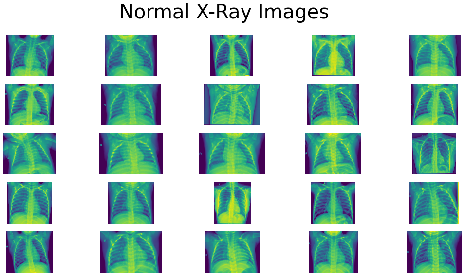
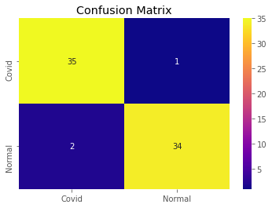
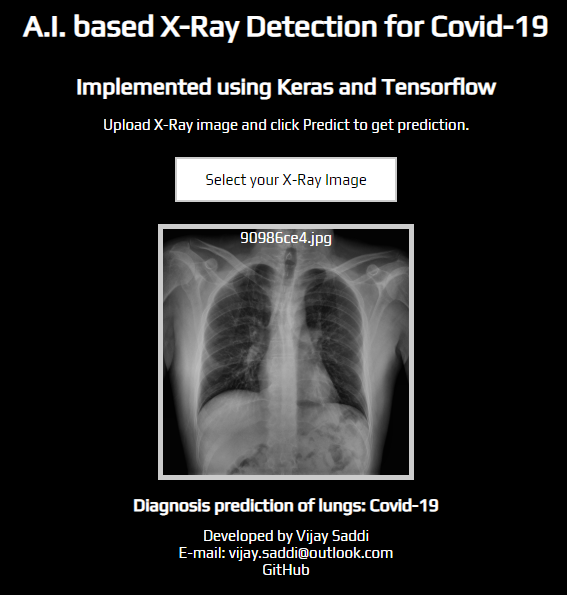

# Covid19 Xray Detection (Model and Deployed Web App)

Link to deployed web app: https://covid19xraydetection.herokuapp.com/

Link to PowerPoint presentation: https://drive.google.com/file/d/1BHSFPZff6zIVHKDXDgKMDVe1YQ_XaSF8/view?usp=sharing

## Table of Contents

- [Project Summary](#summary)
  - [Model Introduction](#deeplearningmodel)
  - [Data Source](#datasource)
  - [Results](#results)
- [Web App](#webapp)
  - [Prerequisites](#prereq)
  - [App Deployment](#deployment)
***

<a id='summary'></a>
# Project Summary
The goal of this project is to build an educational model which can predict if an x-ray image represents a healthy individual, or infected with Covid-19. With image data taken from both GitHub and Kaggle, a Convolutional Neural Newtork was trained using Tensorflow and Keras. The result was a model which can predict with **96% accuracy**,  a precision of 97%, recall of 94% and f1-score of 96. Based on the loss function results, the model does not overfit to the training data set. Some next steps include using transfer learning and Imagenet to increase the sample size and thus adding more statistical significance to the results.

I then proceeded to developing a small scale web app, available via Heroku. Through this app, the user can upload an x-ray image and the model will return a prediction.


<a id='deeplearningmodel'></a>
## Introduction
Within the last decade, deep learning techniques have become much more readily available for the masses to use for research, enterprise and personal use. In particular, applications to the medical field are becoming much more widespread as this technology can greatly assist with radiology.

The unfortunate outbreak of Covid-19 has also let to a radical shift towards improving medical technologies and processes. The aim of this project, ableit educational, is to build a simple model which can differentiate between a healthy (normal) lung xray and an xray of a lung infected with Covid-19.

To re-iterate, this project is intended for educational purposes only, and not to be taken as a vetted model for Covid-19 assessments.

<a id='datasource'></a>
## Data Source
One of the main benefits of the open-source community is the ability to find readily available datasets for which to work with.

Two main datasets were used for this project:

- Covid-19 infected lung images were taken from: https://github.com/ieee8023/covid-chestxray-dataset
- Healthly lung images were taken from: https://www.kaggle.com/paultimothymooney/chest-xray-pneumonia

The images were downloaded and preprocessed prior to training the model. For example, the dataset contains xray images of patients diagnosed with illnesses other that Covid-19, and we filtered them out. In addition, only PA (Postero-Anterior) images, or frontal images were used for model training.

The standard 80/20 split for training and testing data was applied. After filtering throught the data, we were left with 180 Covid xray images to use. The same number of healthy images were used.

The final breakdown of images used for the model:

- Training: 144 images for each category (Covid & Normal)
- Testing: 36 images for each category (Covid & Normal)



The steps taken to pre-process the data can be viewed in this notebook: https://nbviewer.jupyter.org/github/vijay-ss/Covid19-Xray-Detection/blob/master/dataset_preprocessing.ipynb

<a id='results'></a>
## Results
Throughout the project, a Convolutional Neural Network was built and trained using Keras and Tensorflow. The loss function used was binary crossentropy with an optimizer function of Adam.

The average model accuracy was 96% with a precision of 97%, recall of 94% and f1-score of 96%:




From these fairly strong results, we must be weary of the small data set used. To further evaluate the model, transfer learning could be used in order to have a larger data set to work with. This would yield a stronger application to unseen test data.

Another use case which can be taken from using this model, is to build an application which can take an xray image as input, and output the class which it belongs to (Covid or Normal).

<a id='webapp'></a>
# Web App

Link to deployed web app: https://covid19xraydetection.herokuapp.com/

Continuing from the previous section on creating the CNN model, I proceeded to developing a deployable web app, to demonstrate the potential use-case - which is to assist with medical imaging. Using this app, a user can upload an x-ray image and a prediction will be returned. In a medical setting, this can assist professionals when making key diagnoses.



## Getting Started

These instructions will get you a copy of the project up and running on your local machine for development and testing purposes. See deployment for notes on how to deploy the project on a live system.

<a id='prereq'></a>
### Prerequisites

Libraries and software used to create the environment and deploy the app

```
* Python 3.7
* Packages: Tansorflow, Keras, Numpy
* Flask for setting up a local web server
* Basic HTML/CSS/JS for configuring and styling the web app
* Knowledge on setting up a virtual environment
```

#### Tools
```
* An IDE such as VS Code
* Python libraries listed in the requirements.txt file
* A Heroku account for deployment
```

#### Input Files

The model created in the previous section will be input directly into the web app. These files include:
- covid19_model_adv.josn
- covid19_model_weights.h5

<a id='deployment'></a>
## App Deployment

The web app (app.py) was programmed using python code, combined with HTML/CSS/JS for attractive web styling. The underlying framework is Flask, which is robust enough for this particular use case.

Upon significant testing in the local virtual environment, the app was deployed online through Heroku. This is the free version, whereby the app goes to sleep after 30 minutes of inactivity - so loading times may vary depending upon when the app is opened.
